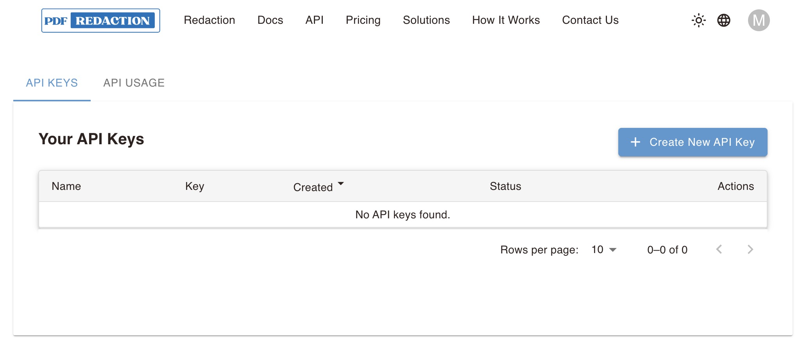
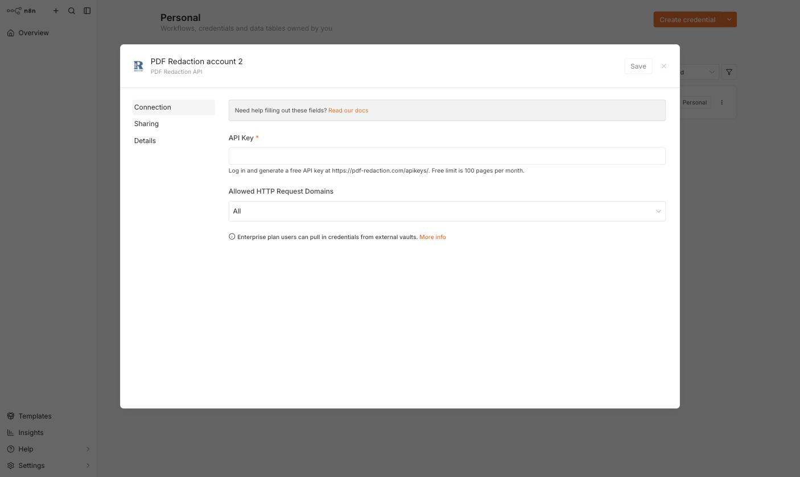
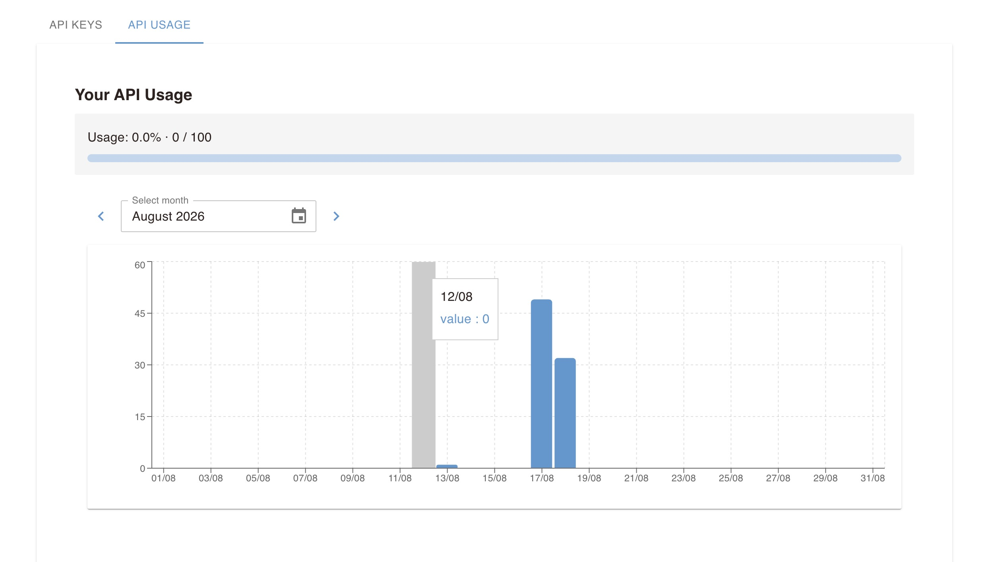
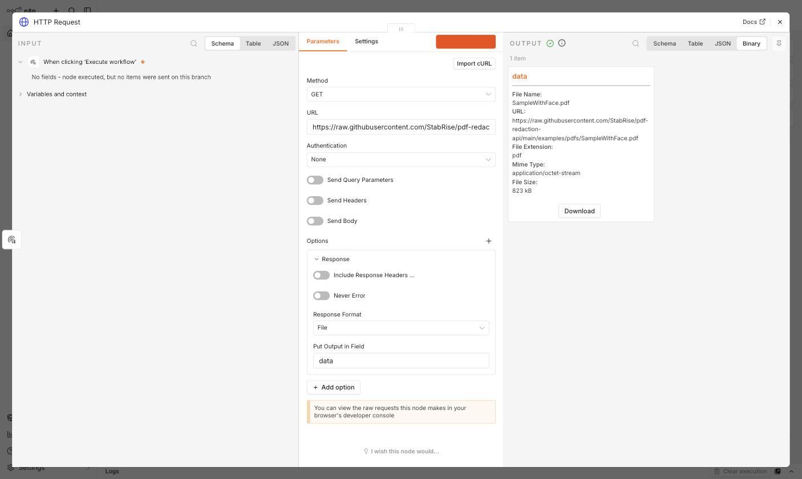
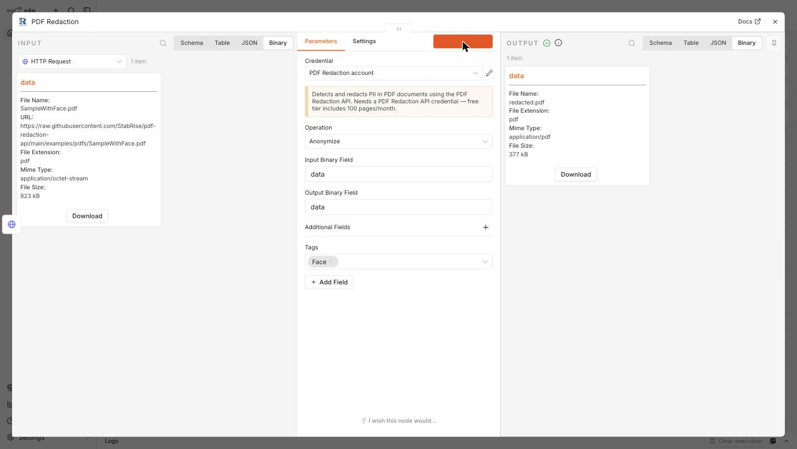
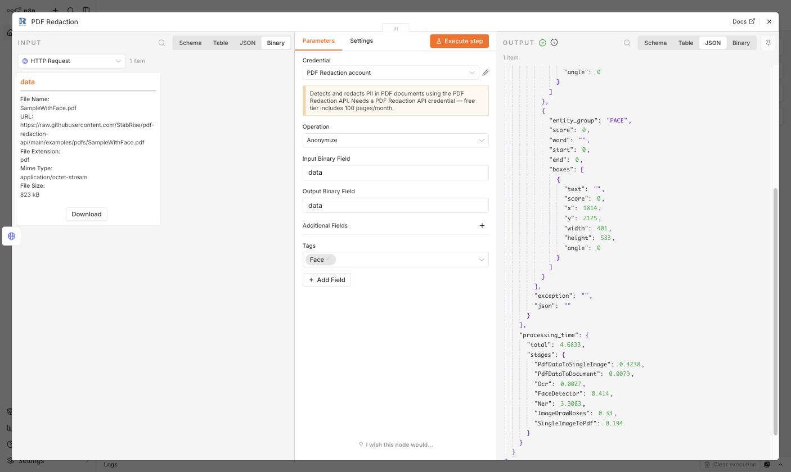
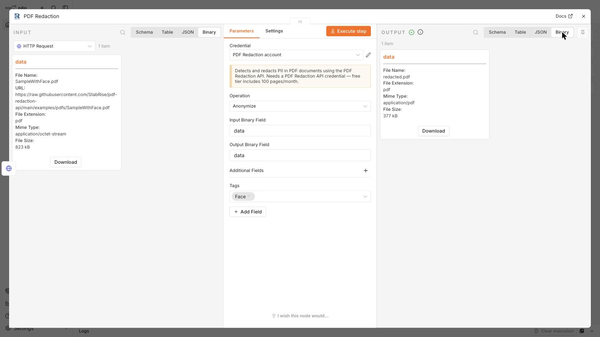
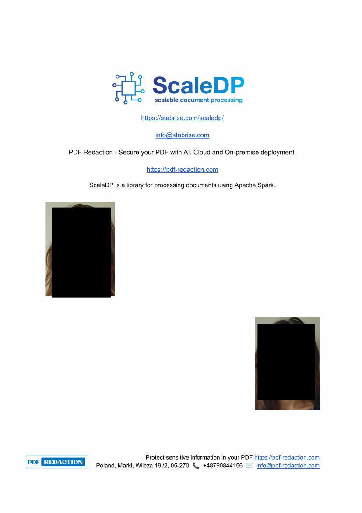
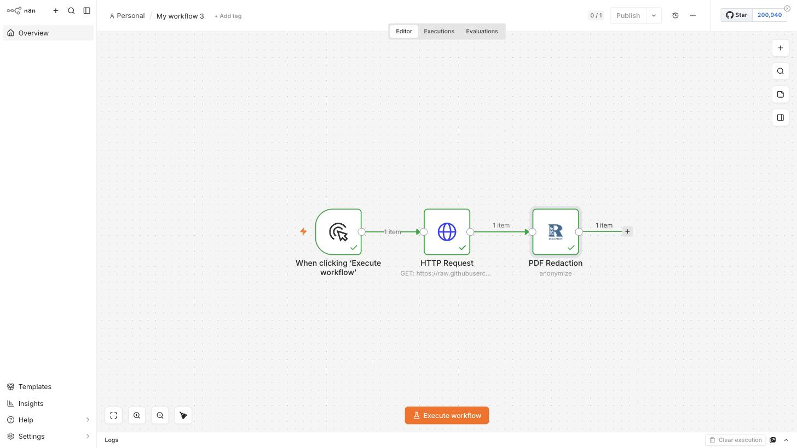

  

# n8n-nodes-pdf-redaction

This is an n8n community node. It lets you detect and redact PII (Personally Identifiable Information) in PDF documents using the [PDF Redaction API](https://pdf-redaction.com/) in your n8n workflows.

[PDF Redaction](https://pdf-redaction.com/) is an AI-powered service that automatically finds and redacts sensitive information in PDFs — both digital and scanned (image-based) documents. See the [pdf-redaction-api](https://pdf-redaction.com/docs/api/) documentation for the underlying REST API, and example notebooks.

[Installation](#installation)
[Operations](#operations)
[Credentials](#credentials)
[Compatibility](#compatibility)
[Usage](#usage)
[Resources](#resources)

## Installation

Follow the [installation guide](https://docs.n8n.io/integrations/community-nodes/installation/) in the n8n community nodes documentation, or the step-by-step [PDF Redaction install & setup tutorial](https://pdf-redaction.com/docs/integrations/n8n/install/) for a walkthrough with screenshots.

## Operations

- **Anonymize** — redact PII in a PDF, choosing which PII types (tags) to detect and redact (dates, names, emails, addresses, credit cards, etc.)
- **Anonymize with Custom Prompt** — redact information described by a free-text prompt instead of predefined tags (e.g. "Redact all dates, names, and email addresses")
- **Detect PII** — scan a PDF for PII and return the detected entities without redacting the document

All operations read the input PDF from a binary property on the input item and, for the anonymize operations, write the redacted PDF back to a binary property on the output item. Every operation also returns `detected_pii` (entities with bounding boxes) and `processing_time` metrics in the output JSON.

### What it can detect and redact

Dates, person names, organizations, locations, emails, phone numbers, IDs, account numbers, zip codes, addresses, IP addresses, URLs, SSNs, driver licenses, passports, passwords, ages, credit card numbers, money amounts, signatures, QR codes, and faces — plus your own custom tags. Detection works on both digital PDFs and scanned/image-based PDFs (via OCR, with support for multiple languages), including rotated text.

### Limits

Only the first 10 pages of a document are processed per request, and free-tier accounts are additionally capped (at the time of writing: 10 pages/request, 100 requests/month, 5 requests/minute) — check your plan at [pdf-redaction.com/apikeys](https://pdf-redaction.com/apikeys/) for current limits.

## Credentials

This node uses an API key credential (**PDF Redaction API**):

1. Go to [pdf-redaction.com/apikeys](https://pdf-redaction.com/apikeys/) and generate an API key.
2. In n8n, create a new **PDF Redaction API** credential and paste the key into the **API Key** field.

  

   
  The credential form inside n8n — paste the key you generated above into the <b>API Key</b> field and save.

Once your key is active, the [API Usage](https://pdf-redaction.com/apikeys/usage/) tab on the same page tracks consumption against your plan — a running total plus a day-by-day breakdown — so you can see how close you are to your monthly cap before a workflow starts failing.

  

## Compatibility

Compatible with n8n@1.60.0 or later

## Usage

The example below wires up a small workflow that pulls a PDF from a URL and blacks out any faces it contains, then inspects what came back.

**1. Fetch a file.** An **HTTP Request** node (`GET`, Response Format set to `File`) grabs the source PDF and hands it downstream as binary data on its `data` field.

  

**2. Configure the node.** Drop a **PDF Redaction** node after it, pick your credential, leave **Operation** on `Anonymize`, and add `Face` under **Additional Fields → Tags**. Since both nodes default to a `data` binary field, no field mapping is needed.

  

**3. Run it.** Executing the node returns a processed file plus a JSON payload describing every match — here, the two faces it located, each with a bounding box, alongside a per-stage timing breakdown.

  

  

**4. Check the result.** Opening the output file confirms both faces are blacked out on the page.

  

**5. The finished workflow.** Three nodes, each with a green checkmark after a successful run.

  

Any node that produces binary data works as the source — a webhook payload, **Read/Write File from Disk**, an email attachment, or a cloud-storage node — as long as its output field name matches the **Input Binary Field** you set on PDF Redaction.

For the full step-by-step tutorials this walkthrough is based on, see:

* [Install & configure the node](https://pdf-redaction.com/docs/integrations/n8n/install/)
* [Anonymize a PDF, end to end](https://pdf-redaction.com/docs/integrations/n8n/anonymize-pdf/)
* [Detect PII without redacting](https://pdf-redaction.com/docs/integrations/n8n/detect-pii/)

## Resources

* [n8n community nodes documentation](https://docs.n8n.io/integrations/#community-nodes)
* [PDF Redaction website](https://pdf-redaction.com/)
* [PDF Redaction API docs (Swagger)](https://api.pdf-redaction.com/api/docs)
* [PDF Redaction API key management](https://pdf-redaction.com/apikeys/)
* [pdf-redaction-api](https://github.com/StabRise/pdf-redaction-api) — Python client, example notebooks, and self-hosting instructions for the underlying API
