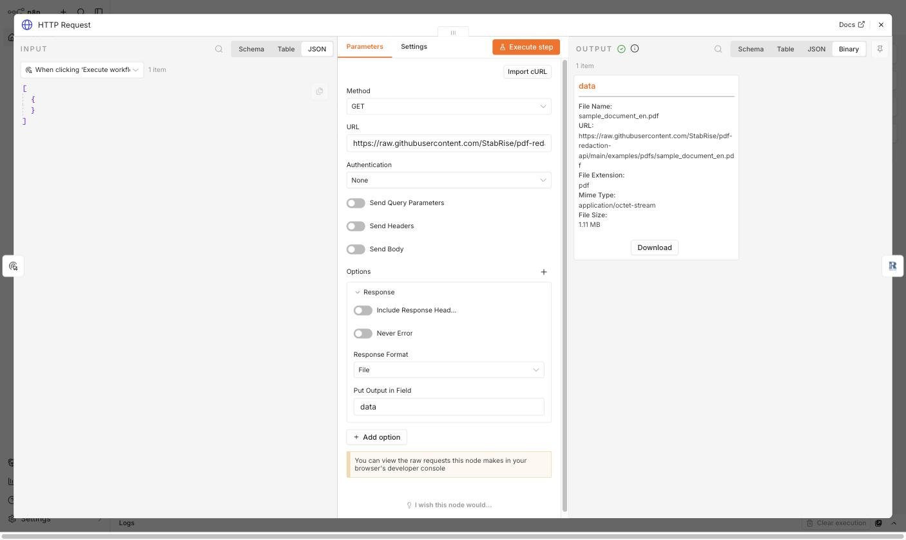
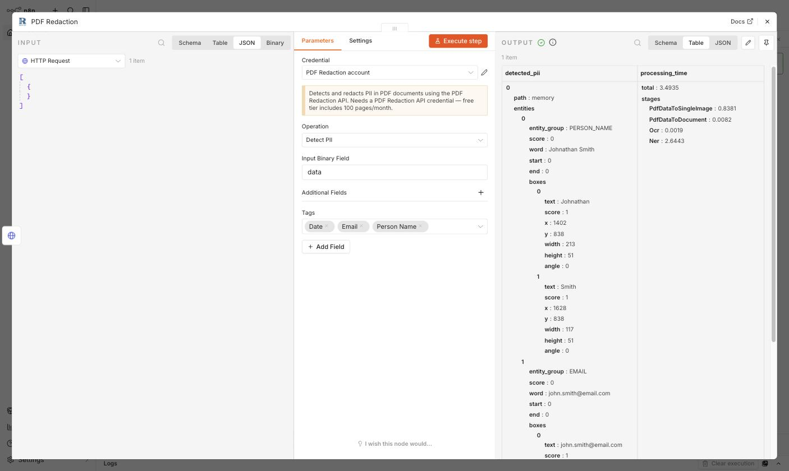
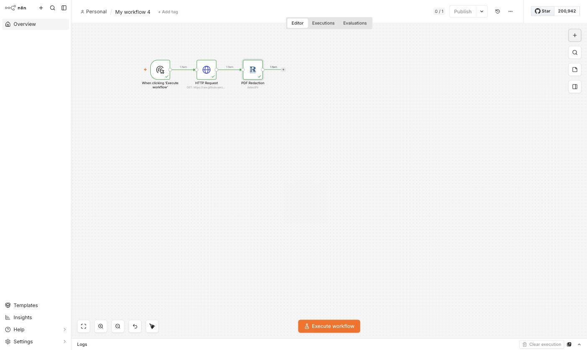

# Tutorial: detect PII in a PDF without redacting it

Use the **Detect PII** operation when you want to know what sensitive information is in a document — for auditing, building a review step before redacting, or routing documents based on what they contain — without modifying the PDF itself.

This tutorial builds a runnable n8n workflow that fetches a public sample document and detects names, emails, and dates in it.

For the general setup/configuration walkthrough, see [install.md](install.md) first. For redacting a PDF (rather than just detecting PII in it), see [anonymize-pdf.md](anonymize-pdf.md). This guide assumes the node is installed and you have a **PDF Redaction API** credential already.

## 1. Trigger + HTTP Request

Start with a **Manual Trigger**, then add an **HTTP Request** node with:

- **Method**: `GET`
- **URL**: `https://raw.githubusercontent.com/StabRise/pdf-redaction-api/main/examples/pdfs/sample_document_en.pdf`
- **Options → Response → Response Format**: `File`

Execute the node — the sample document (1.11 MB) comes back as binary data in the `data` field:

## 2. PDF Redaction — Detect PII

Add a **PDF Redaction** node after the HTTP Request node and set:

- **Credential**: your **PDF Redaction API** credential
- **Operation**: `Detect PII`
- **Additional Fields → Tags**: pick the PII types to look for — this example uses `Date`, `Email`, `Person Name`

Unlike **Anonymize**, this operation has no **Output Binary Field** — it doesn't produce a modified PDF, only detection results.

## 3. Execute and inspect the output

Click **Execute step**. The output's `detected_pii[].entities` array lists every match, each with an `entity_group` (e.g. `PERSON_NAME`, `EMAIL`), the matched `word`, and `boxes` giving the pixel location on the page:

For this document, the node found entries like:

- `PERSON_NAME` — `"Johnathan Smith"`
- `EMAIL` — `"john.smith@email.com"`

along with `Date` matches further down the list, plus the usual `processing_time` breakdown.

## 4. The complete workflow

## Notes

- If you leave **Tags** empty, the API only reports the entity types it's configured to detect by default for the request — for predictable results, always set the tags you care about explicitly.
- Combine **Detect PII** with an **IF** or **Switch** node downstream to branch a workflow based on what was found (e.g. only redact documents where `detected_pii` is non-empty).
- To then redact what you found, feed the same input into a second **PDF Redaction** node set to **Anonymize** with matching tags — see [anonymize-pdf.md](anonymize-pdf.md).

## More resources

- [PDF Redaction n8n integration docs](https://pdf-redaction.com/docs/integrations/n8n/)
- [PDF Redaction API docs (Swagger)](https://api.pdf-redaction.com/api/docs)
