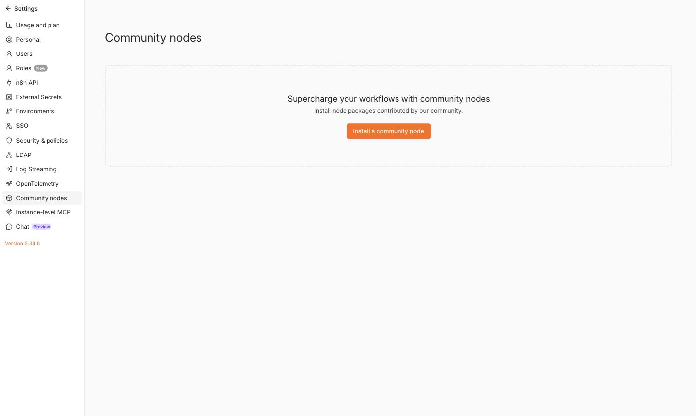
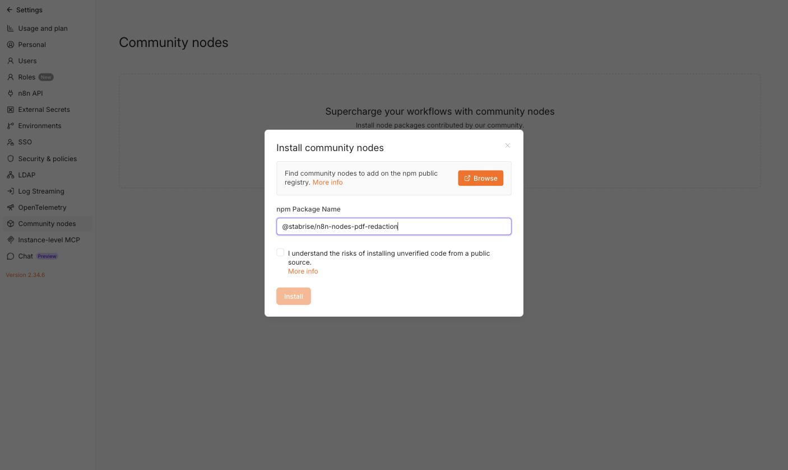
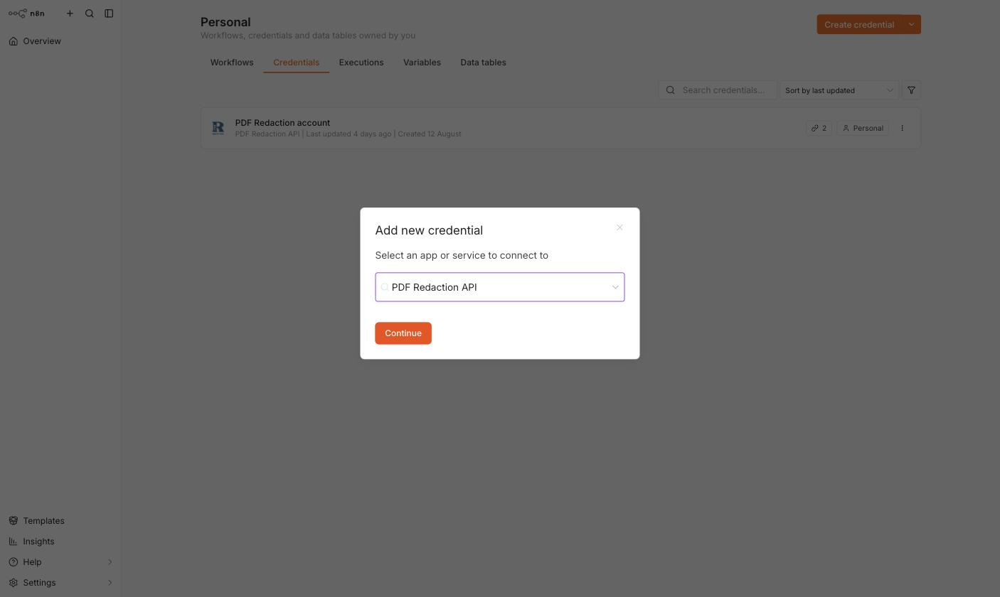
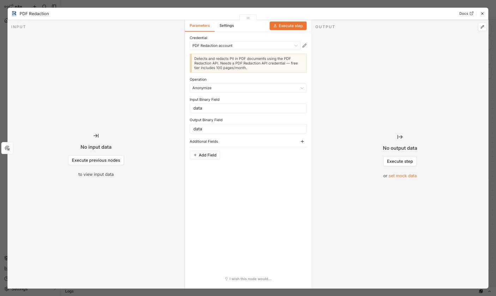
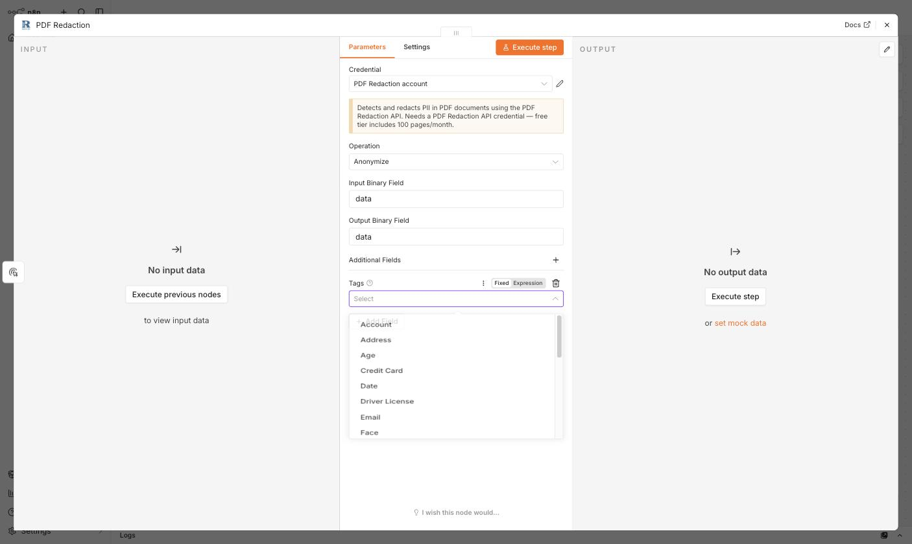
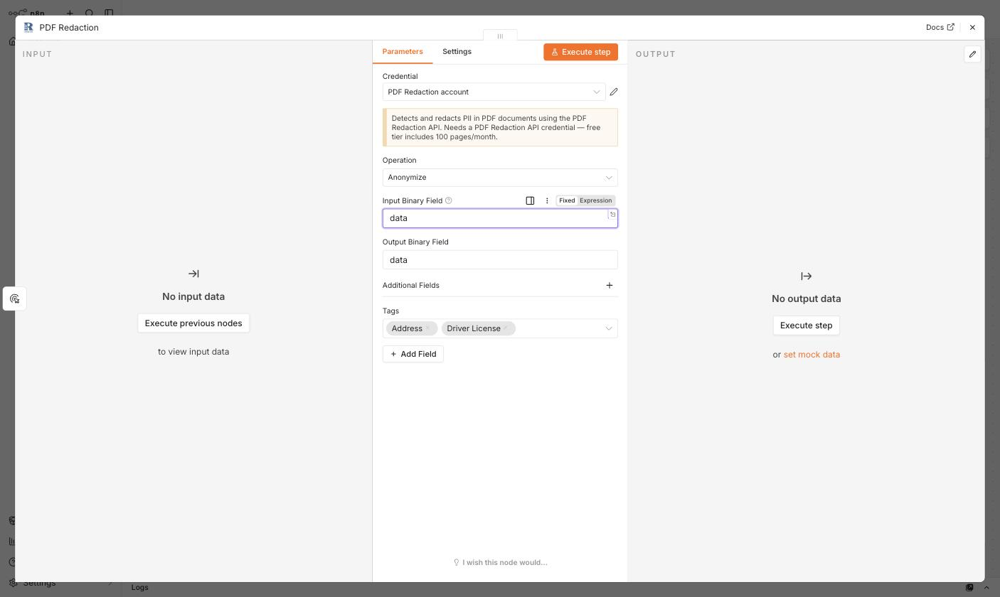
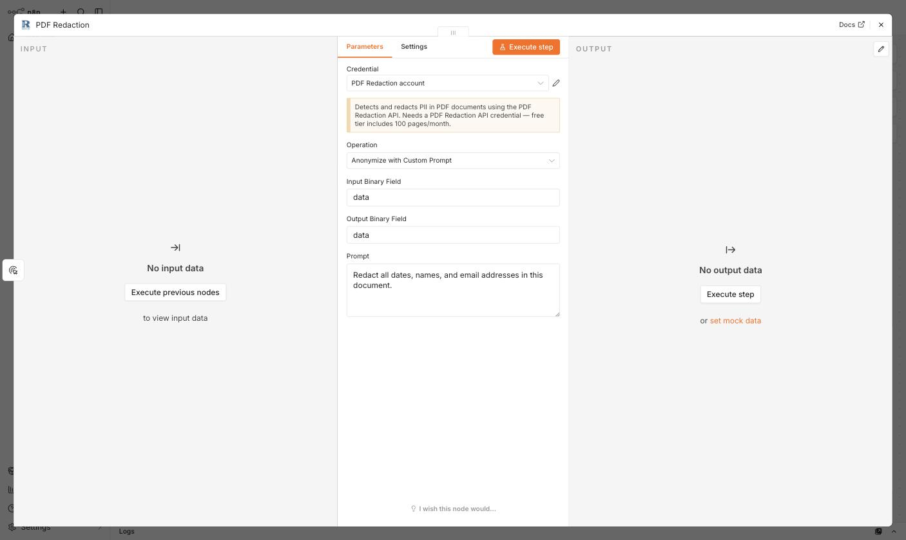
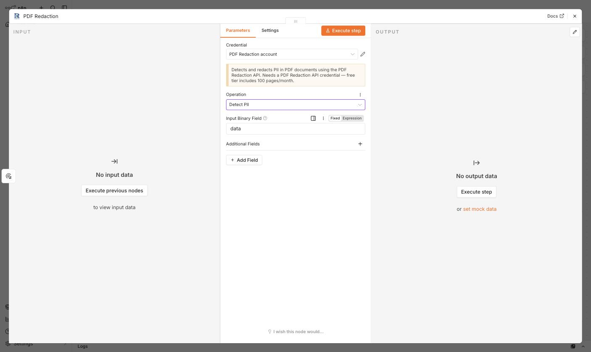

# PDF Redaction n8n node — setup, configuration, and usage tutorial

This tutorial walks through installing the **PDF Redaction** community node, creating the credential it needs, and configuring each of its three operations: **Anonymize**, **Anonymize with Custom Prompt**, and **Detect PII**.

## 1. Install the node

In your n8n instance, go to **Settings → Community Nodes**.

Click **Install a community node**, enter the package name `@stabrise/n8n-nodes-pdf-redaction`, accept the risk notice, and click **Install**.

Once installed, the **PDF Redaction** node is available in the node panel, and the **PDF Redaction API** credential type is available when creating credentials.

## 2. Create the API credential

The node authenticates with the [PDF Redaction API](https://pdf-redaction.com/) using an API key.

1. In n8n, go to **Credentials → Create Credential** and search for **PDF Redaction API**.

   

2. Log in and generate a free API key at [pdf-redaction.com/apikeys](https://pdf-redaction.com/apikeys/) — the free tier includes 100 pages/month.
3. Paste the key into the **API Key** field and save.

   

## 3. Add the node to a workflow

Add a **PDF Redaction** node after a step that provides a PDF as binary data (e.g. an HTTP Request, Read/Write File from Disk, or a trigger with a file attachment), and select your **PDF Redaction API** credential.

The node's **Operation** field controls what it does. By default it's set to **Anonymize**.

- **Input Binary Field** / **Output Binary Field** — the binary property names to read the source PDF from and write the result to (both default to `data`).

## 4. Configure "Anonymize"

Use **Anonymize** to redact PII using a predefined set of tags. Open **Additional Fields → Tags** and pick the PII types to redact (dates, names, emails, addresses, credit cards, and more).

Once selected, the tags appear as chips on the field:

Other **Additional Fields** let you fine-tune detection: **Custom Tags** (your own labels), **Force OCR**, **OCR Languages**, **Redact Text**, **Rotated Text**, and **Min Chunk Size**.

## 5. Configure "Anonymize with Custom Prompt"

Instead of picking tags, describe what to redact in plain English via the **Prompt** field:

This is useful for redaction rules that don't map cleanly onto the predefined tags (e.g. "redact anything that looks like an internal project codename").

## 6. Configure "Detect PII"

Use **Detect PII** to scan a document and get back the detected entities (with bounding boxes) without modifying the PDF — useful for auditing or building a review step before redacting.

## 7. Run the workflow

Every operation reads the source PDF from the configured input binary field. The anonymize operations write the redacted PDF to the output binary field; all operations also return `detected_pii` (entities with bounding boxes) and `processing_time` in the output JSON.

Click **Execute step** (or run the whole workflow) to process the PDF and inspect the output panel for the redacted file and detected entities.

## Limits

Only the first 10 pages of a document are processed per request. Free-tier accounts are additionally capped (at the time of writing: 10 pages/request, 100 requests/month, 5 requests/minute) — check current limits at [pdf-redaction.com/apikeys](https://pdf-redaction.com/apikeys/).

## See also

For a complete, runnable example that fetches a real PDF over HTTP and redacts it end to end, see [anonymize-pdf.md](anonymize-pdf.md). To scan a document for PII without modifying it, see [detect-pii.md](detect-pii.md).

## More resources

- [PDF Redaction n8n integration docs](https://pdf-redaction.com/docs/integrations/n8n/)
- [PDF Redaction API docs (Swagger)](https://api.pdf-redaction.com/api/docs)
- [n8n community nodes documentation](https://docs.n8n.io/integrations/#community-nodes)
